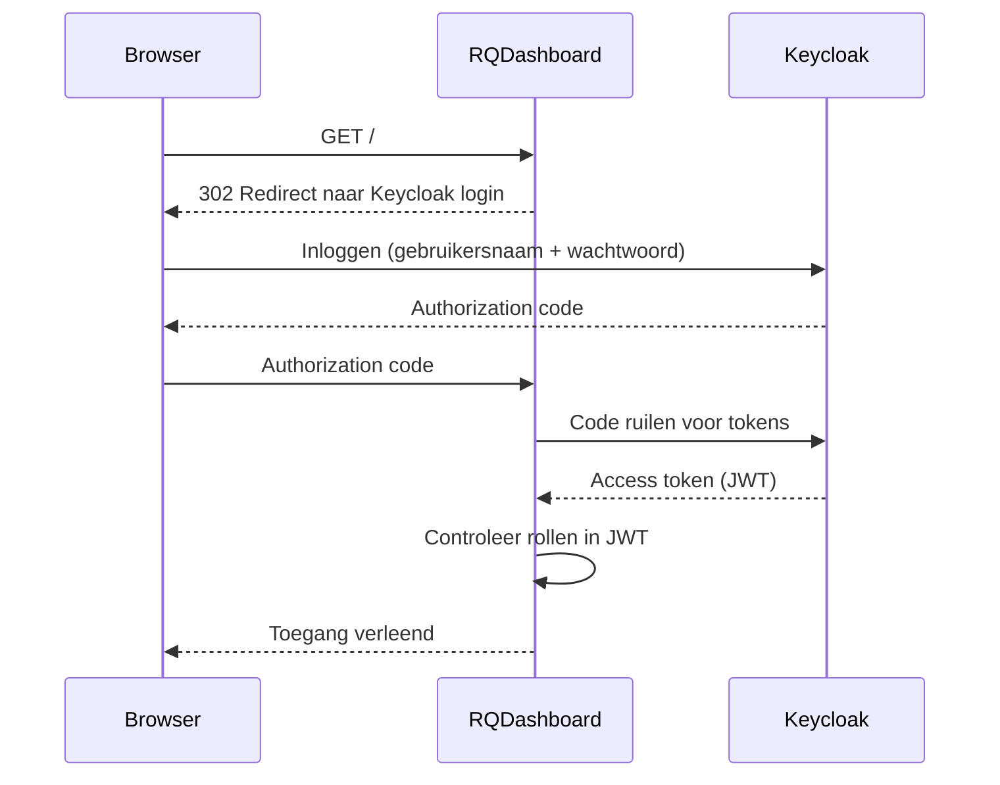

::title::

RQ-Dashboard

::subtitle::

Van LDAP naar Keycloak SSO

::footer::

---
layout: full-width
pageTitle: Python 3.12 migratie
pageSubtitle: Het LDAP-probleem

---

- rq-dashboard werd gemigreerd naar **Python 3.12**
- De bestaande LDAP-package (`python-ldap`) is **niet compatibel** met Python 3.12
  - Wheel-bestanden zijn alleen beschikbaar voor Python ≤ 3.8
  - Een build-stap vanuit broncode is vereist — niet wenselijk in onze pipeline
- **Keycloak** was inmiddels beschikbaar als authenticatieplatform binnen de organisatie
- Beslissing: LDAP volledig vervangen door **SSO via Keycloak**

---
layout: full-width
pageTitle: OAuth2-flow met Keycloak

---

<div style="margin-left: 30%; transform-origin: top left;">
<Transform :scale="0.78">



</Transform>
</div>

---
layout: split
pageTitle: JWT – Wat zit er in het token?

---

::left::

Een **JWT (JSON Web Token)** bestaat uit drie delen:

- **Header** – algoritme en type
- **Payload** – claims: gebruikersdata én rollen
- **Signature** – cryptografische verificatie

rq-dashboard leest de **`roles`** claim uit het token om toegang te bepalen.

::right::

```json
{
  "sub": "a1b2c3d4-...",
  "preferred_username": "jan.jansen",
  "roles": [
    "rq-dashboard-viewer",
    "offline_access"
  ],
  "exp": 1746000000
}
```

---
layout: full-width
pageTitle: Rolcontrole in rq-dashboard

---

- rq-dashboard heeft een configureerbare lijst van **toegestane rollen**
- Bij elk verzoek wordt het JWT-token uitgelezen en geverifieerd
- Geen overeenkomst → **toegang geweigerd**
- Geen maatwerk-sessies, geen LDAP-queries — puur **standaard OAuth2 / OIDC**

---
layout: full-width
pageTitle: cog-comp-rq-dashboard – wat is er veranderd?

---

- **LDAP-dependency verwijderd** — geen `python-ldap` meer
- **OAuth2-client geïmplementeerd** via standaard OIDC-integratie
- Keycloak-verbinding en realm zijn nu configureerbaar per instantie
- Toegang wordt bepaald op basis van **rollen in het JWT-token**
- Alle rq-dashboard-instanties vereisen nu een **OAuth-client** in Keycloak én in de chart-configuratie

---
layout: full-width
pageTitle: Uitrol & configuratie

---

Applicaties die rq-dashboard embedden via een umbrella chart (zoals IIH en GO) hebben een **major versie-bump** gekregen — een expliciet signaal dat nieuwe configuratie vereist is.

Voor elk van deze umbrella charts liggen **PRs klaar** met de benodigde Keycloak-configuratie. Teams kunnen deze PR mergen op het moment dat het in hun eigen releaseschema past.

---
layout: split
leftBackground: "#8FCAE7"
rightBackground: "#edf4f8"
leftInset: "0"

---

::left::

<QuestionsIllustration />

::right::

## Vragen?
