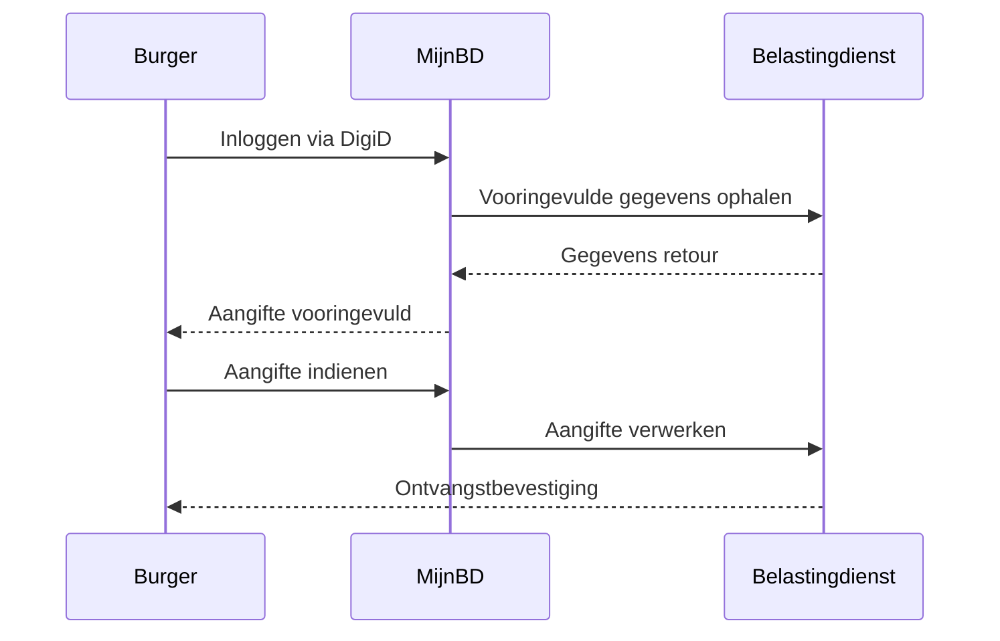
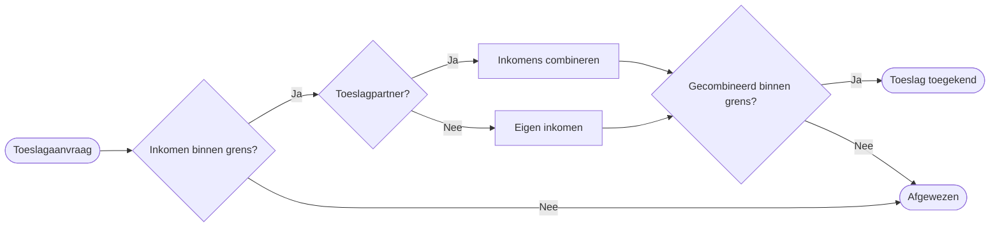
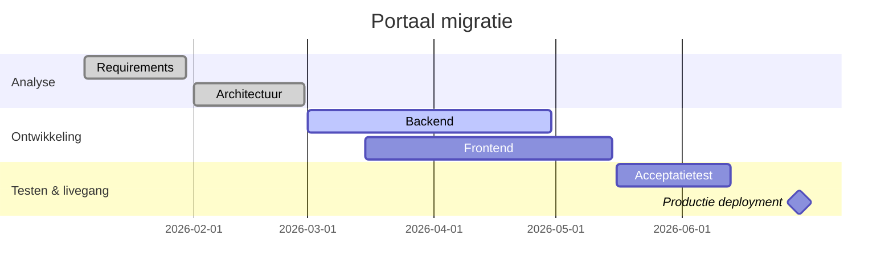
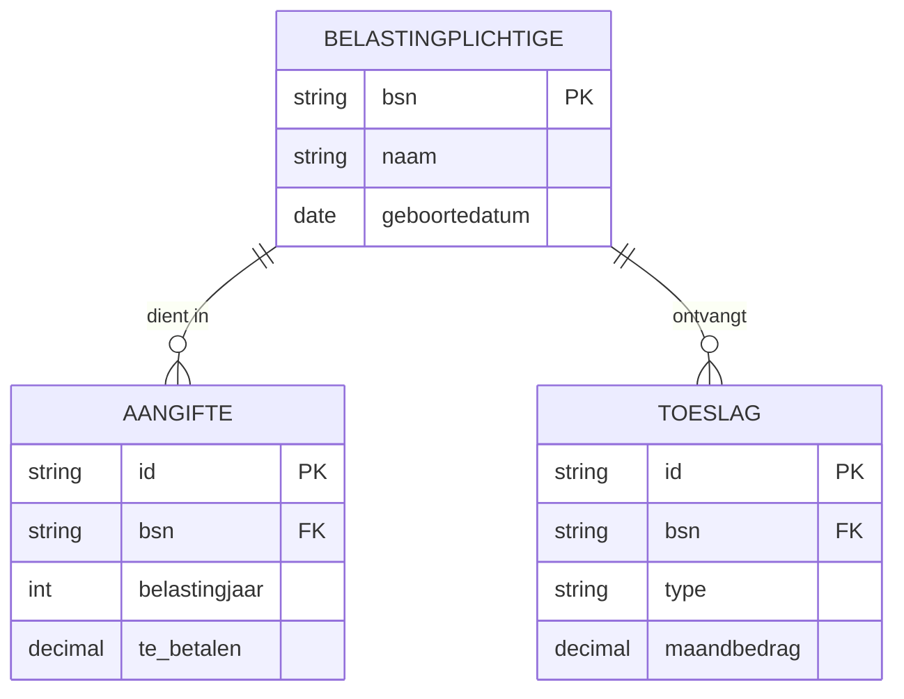

::background::


::title::

Slidev belastingdienst thema
**Thema-demonstratie**

::footer::

<div>2026</div>

<!--
AGENT INSTRUCTIONS: USING THIS FILE AS A THEME REFERENCE

This is the authoritative reference for slidev-theme-belastingdienst.
Every layout and component the theme provides is demonstrated here with
usage examples and code snippets.

Use this deck to:
  - understand what layouts and components are available
  - copy code examples when building a new presentation
  - verify that theme changes render correctly

To start a new presentation, copy presentations/template/ instead.
This deck is not meant to be copied — it uses the bd-examples addon
for demo-only helper components that should not appear in real decks.
-->

---
layout: speaker
speakerName: "[Naam spreker]"
speakerRole: "[functie - met kleine letter]"
speakerTeam: "[Team - met hoofdletter]"

---

<!-- -->

---
layout: chapter
variant: content-right
chapterTitle: Inhoudsopgave

---

<NumberedList
  :items="[
    { label: 'Introductie', detail: 'Waarom Slidev en hoe deze deck werkt' },
    { label: 'Maten en stijl', detail: 'Maatvoering en tekstopmaak' },
    { label: 'Herbruikbare layouts', detail: 'Layouts en kleurinstellingen' },
    { label: 'Herbruikbare componenten', detail: 'Tabellen, diagrammen en infographic componenten' },
  ]"
/>

---
layout: fact-panel
panelTitle: Waarom slidev?
image: /images/voorbeeld-foto-1.jpg
imageCropLeft: 34.381
imageCropRight: 6.314
rows:

- iconName: tegelweergave
  lead: Herbruikbare layouts
  body: Kant-en-klare layouts en componenten voor iedere dia
- iconName: rijkshuisstijl
  lead: Belastingdienst huisstijl
  body: Gebaseerd op Rijkshuisstijl en merkrichtlijnen
- iconName: intelligence
  lead: Eenvoudig met AI
  body: Maak presentaties met een coding agent

---

<!-- -->

---
layout: split
pageTitle: Over deze demonstratiedeck

---

::left::

## Wat je hier vindt

Dit is de **thema-demonstratie** voor `slidev-theme-belastingdienst`. Elke layout en elk component van het thema is hier gedemonstreerd met uitleg en voorbeeldcode.

Gebruik deze deck als **naslagwerk** bij het opbouwen van een nieuwe presentatie — niet als startpunt om te kopiëren. Het `bd-examples` addon bevat demo-helpersdie niet bedoeld zijn voor echte presentaties.

::right::

## Opbouw

- **Lint als maatvoering** — de basiseenheid `X`
- **Typografie & kleuren** — beschikbare tekststijlen en tokens
- **Herbruikbare layouts** — alle layoutvarianten met voorbeeldcode
- **Herbruikbare componenten** — Vlak, Tabel, DonutChart, HighlightsGrid, StepSeries en meer
- **Compositie-voorbeelden** — complete slides als inspiratie

Voor een nieuwe presentatie: gebruik `presentations/template/` als startpunt.

---
layout: split
pageTitle: Lint als maatvoering
rightBackground: "#edf4f8"
clicks: 2

---

::left::

## Vaste meeteenheid

- De breedte van het lint is de basiseenheid `X`
- De contentgrens ligt `1X` uit de buitenrand: `1/2 X` marge + `1/2 X` inset
- Boven de content geldt: linthoogte + `1/2 X`
- Tussen de twee contentvlakken ligt effectief `2X`

## Vertaling naar slides

- Plaats eerst het lint exact midden bovenaan
- Gebruik in slides het SVG-lint van `1X x 2X`
- Lees rechts: buitenkader = slide, oranje kader = contentgrens
- Meet vanaf het hele slidevlak, niet vanaf een halve kolom

::right::

<MeasurementExplainer :clicks="$clicks" />

---
layout: split
pageTitle: Typografie
rightBackground: "#8FCAE7"

---

::left::

## Tekstopmaak

Schrijf `## Koptekst` voor een kop op 20pt (h2). Gebruik `#` voor 26pt (h1)
of `###` voor 16pt (h3). De paginatitel bovenaan is altijd 19pt via `pageTitle`.

## Bodytekst en lijsten — 12pt

- Gewone alinea's en lijstitems renderen op 12pt
- Gebruik `**vet**` of `_cursief_` voor nadruk
- De koptekst links (28pt) is de display-grootte van het split-layout

::right::

<div style="display: grid; gap: 0.5rem; align-content: start; color: var(--bd-contrastkleur-lintblauw);">
  <div style="font-size: 26pt; line-height: 1.1;"># H1 — 26pt</div>
  <div style="font-size: 20pt; line-height: 1.1;">## H2 — 20pt</div>
  <div style="font-size: 16pt; line-height: 1.1;">### H3 — 16pt</div>
  <div style="font-size: 13pt; line-height: 1.1;">#### H4 — 13pt</div>
  <div style="font-size: 12pt; line-height: 1.3; margin-top: 0.5rem;">Bodytekst — 12pt</div>
  <div style="font-size: 19pt; line-height: 1.1; margin-top: 0.5rem; opacity: 0.6;">pageTitle — 19pt</div>
  <div style="font-size: 28pt; line-height: 1.1; opacity: 0.6;">display (split) — 28pt</div>
</div>

---
layout: split
pageTitle: Kleuren
rightBackground: "#ffffff"

---

::left::

## CSS-tokens

Gebruik altijd de token-naam, nooit een vaste hex.
Zo blijft de presentatie consistent met de huisstijl.

- **Lintblauw** — koppen, iconen, dominante UI-elementen
- **Lichtblauw-tints** — achtergronden, strepen, panels
- **Accentkleuren** — dataseries in grafieken, highlights
- **Signaalkleur** — status en waarschuwingen
- **Tekst** — bodytekst en secundaire labels

::right::

<ColorPaletteDemo />

---
layout: chapter
chapterNumber: "03"
chapterTitle: Herbruikbare layouts
image: /images/voorbeeld-foto-2.jpg

---

::subtitle::

Alle slides in deze presentatie zijn gemaakt met herbruikbare layouts. Dit is: `chapter`

::bottom::

```yaml
---
layout: chapter
chapterTitle: Mijn sectietitel
---
```

---
layout: image-merktegel
backgroundImage: /images/voorbeeld-foto-2.jpg
backgroundPosition: center 18%
backgroundOffsetY: 75%
variant: statement
placement: bottom-right
eyebrow: image-merktegel

---

Voor wanneer je een groot statement wilt maken

---
layout: image-merktegel
backgroundImage: /images/voorbeeld-foto-3.jpg
backgroundPosition: center 51%
variant: detail
placement: bottom-left
eyebrow: Varianten

---

Layouts hebben varianten om het gedrag of de stijl aan te passen. Dit is variant detail

```yaml
layout: image-merktegel
variant: detail
```

---
layout: content-image
contentTitle: Tekst en beeld
intro: Eerste versie van een presentatie-slide met tekst links en beeld rechts op de vaste middenas.
image: /images/voorbeeld-foto-1.jpg
---

De beeldhelft blijft los van de teksthelft zodat beide vanuit dezelfde centrale
vlakverdeling kunnen worden opgebouwd.

```yaml
layout: content-image
contentTitle: Tekst en beeld
intro: Tekst links en beeld rechts...
image: /images/voorbeeld-foto-1.jpg
```

---
layout: split
pageTitle: Tekst naast beeldvlak
rightBackground: "#ffffff"

---

::left::

In de split-layout heeft elk deelgebied zijn eigen contentgrenzen. Visuele content die je in een van de twee panelen plaatst past zich aan de contentbox aan — de randen worden gehandhaafd.

```md
---
layout: split
pageTitle: Tekst naast beeldvlak
---

::left::

<!-- linker slot: tekst en uitleg -->

::right::


```

::right::


---
layout: full-width
pageTitle: Volledig scherm
pageSubtitle: Inhoudsgebied loopt door tot de rechterrand — geen rechter inhoudsgrens.

---

Gebruik **full-width** voor brede visualisaties: diagrammen, infographics of panoramische beelden. De linker inhoudsgrens (en daarmee de paginatitel) blijft intact; de rechterrand is open.

<Vlak fill="var(--bd-domeinkleur-lichtblauw-15)" style="margin-top: 1.25rem; padding: 1.5rem; text-align: center; color: var(--bd-donkerblauw);">
  ← Inhoudsgebied loopt door tot de rechterrand van de slide →
</Vlak>

```yaml
---
layout: full-width
pageTitle: Mijn titel
---
```

---
layout: chapter
variant: content-right
chapterNumber: "04"

---

::title::

Herbruikbare componenten

::subtitle::

Componenten zijn Vue-elementen: aangepaste HTML-tags die je direct in je markdown plaatst. Je stuurt hun gedrag via properties (props) op de tag.

::opposite::

#### Voorbeeld van een component-tag in markdown

```vue
<DonutChart
  title="Kanaalkeuze"
  :segments="[
    { label: 'Digitaal', value: 63 },
    { label: 'Telefonie', value: 27 },
    { label: 'Balie', value: 10 },
  ]"
/>
```

#### Beschikbare componenten

<Transform :scale="0.55" origin="top left">
<Vlak
  variant="info-grid"
  :columns="2"
  fill="#ffffff"
  :items="['DonutChart', 'HighlightsGrid', 'MerktegelLijn', 'NumberedList', 'QuestionsIllustration', 'StepSeries', 'StepSeriesJoin', 'Table', 'VerticalStepList', 'Vlak']"
/>
</Transform>

---
layout: full-width
pageTitle: Vlak

---

<div style="display:flex; gap:2rem; align-items:flex-start; margin-bottom:1.5rem;">
  <Vlak shape="speech-bottom-right" fill="var(--bd-domeinkleur-lichtblauw-30)" padding="1rem" style="flex:1; min-width:0;">
    Gebruik <code>shape="speech-bottom-right"</code> voor een tekstballon met staart rechtsonder — handig bij citaten of uitleg naast een afbeelding.
  </Vlak>
  <Vlak fill="var(--bd-domeinkleur-lichtblauw-30)" variant="info-grid" :columns="2"
    :items="['Het info-grid-variant verdeelt de inhoud in een raster. Geef <code>:columns</code> mee voor het aantal kolommen.', 'De tweede kolom komt hier']"
    style="flex:1; min-width:0;" />
</div>

<div style="display:flex; gap:0.75rem; align-items:stretch; height:140px; margin-bottom:1.5rem;">
  <Vlak shape="chevron-right" fill="white" border="var(--bd-domeinkleur-lichtblauw)" borderWidth="1.5px" style="flex:1; min-width:0;">
    Vlakken met chevron
  </Vlak>
  <Vlak shape="chevron-right" fill="white" border="var(--bd-domeinkleur-lichtblauw)" borderWidth="1.5px" style="flex:1; min-width:0;">
    Om een proces te visualiseren
  </Vlak>
  <Vlak fill="white" border="var(--bd-domeinkleur-lichtblauw)" borderWidth="1.5px" style="flex:1; min-width:0;">
    In meerdere stappen
  </Vlak>
</div>

<div style="display:flex; gap:0.75rem; align-items:stretch; height:120px; margin-bottom:1.5rem;">
  <Vlak fill="white" border="var(--bd-contrastkleur-lintblauw)" borderWidth="1.5px" style="flex:1; min-width:0;">
    Wat voor vlak je wilt
  </Vlak>
  <Vlak shape="chevron-left" fill="white" border="var(--bd-contrastkleur-lintblauw)" borderWidth="1.5px" style="flex:1; min-width:0;">
    om aan te geven
  </Vlak>
  <Vlak shape="chevron-left" fill="white" border="var(--bd-contrastkleur-lintblauw)" borderWidth="1.5px" style="flex:1; min-width:0;">
    Gebruik de varianten
  </Vlak>
</div>

---
layout: split
pageTitle: Tabel
rightBackground: "#ffffff"
clicks: 2

---

::left::

<div v-if="$clicks === 0">

## Niveau 1

De eenvoudigste manier: geef kolommen en rijen als arrays mee.
Alle celinhoud is platte tekst. Gebruik dit niveau voor feitentabellen
zonder opmaak per cel.

- `:columns` — array van kopteksten
- `:rows` — array van rijen; elke rij is een array van celwaarden
- Standaard: minimale opmaak met alleen horizontale lijnen

</div>

<div v-else-if="$clicks === 1">

## Niveau 2

Gebruik de `#cell` slot om cellen eigen opmaak te geven, zoals een
kleurcode of een icoon. Rijen worden nog steeds door `:rows` opgebouwd.

- Slot ontvangt `{ value, row, rowIndex, colIndex }`
- Jij levert de *inhoud* van de `<td>`, niet de `<td>` zelf
- Alle overige kolommen vallen door naar platte tekst via `<template v-else>`

</div>

<div v-else>

## Niveau 3

Maximale controle: schrijf de rijen zelf als `<tr>` en `<td>`.
Kopteksten komen nog van `:columns`, de body is volledig vrij.

- Gebruik voor samengevoegde cellen, meerdere regels of rijhighlights
- Row striping does not apply; add `background` inline on `<td>` if needed
- Totaalrijen: gebruik `border-top` om het einde van de data aan te geven

</div>

::right::

<!--
  Level 1: props only.
  columns = array of header labels (strings).
  rows    = array of rows; each row is an array of cell values (strings).
-->
<Table
  v-if="$clicks === 0"
  :columns="['Kanaal', 'Q1 2025', 'Q2 2025', 'Trend']"
  :rows="[
    ['Telefonie',            '91%', '94%', '↑'],
    ['Post',                 '68%', '61%', '↓'],
    ['Mijn Belastingdienst', '98%', '99%', '↑'],
    ['Balie',                '82%', '82%', '→'],
  ]"
/>

<!--
  Niveau 2: #cell scoped slot.
  The slot receives: { value, row, rowIndex, colIndex }
  You return the *contents* of the <td>, not the <td> itself.
  Here the last column (colIndex 3) gets a colour-coded trend indicator.
-->
<Table
  v-else-if="$clicks === 1"
  :columns="['Kanaal', 'Q1 2025', 'Q2 2025', 'Trend']"
  :rows="[
    ['Telefonie',            '91%', '94%', 'stijging'],
    ['Post',                 '68%', '61%', 'daling'],
    ['Mijn Belastingdienst', '98%', '99%', 'stijging'],
    ['Balie',                '82%', '82%', 'stabiel'],
  ]"
>
  <template #cell="{ value, colIndex }">
    <span
      v-if="colIndex === 3"
      :style="{
        color: value === 'stijging'
          ? 'var(--bd-signaalkleur-groen)'
          : value === 'daling'
            ? 'var(--bd-signaalkleur-rood)'
            : 'var(--bd-contrastkleur-lintblauw)',
        fontWeight: 'bold',
      }"
    >{{ value }}</span>
    <template v-else>{{ value }}</template>
  </template>
</Table>

<!--
  Level 3: default slot — full row control.
  - Write <tr> and <td> elements yourself inside <Table>.
  - :columns still drives the header row.
  - Row striping does not apply; add backgrounds inline on <td> if needed.
  - Total rows: use a top border to signal "end of data".
-->
<Table v-else :columns="['Kanaal', 'Score', 'Toelichting']">
  <tr>
    <td>Telefonie</td>
    <td><strong style="color:var(--bd-signaalkleur-groen)">94%</strong></td>
    <td>Boven streefwaarde; capaciteit stabiel</td>
  </tr>
  <tr>
    <td style="background:var(--bd-domeinkleur-lichtblauw-15)">Post</td>
    <td style="background:var(--bd-domeinkleur-lichtblauw-15)"><strong style="color:var(--bd-signaalkleur-rood)">61%</strong></td>
    <td style="background:var(--bd-domeinkleur-lichtblauw-15)">Onder norm; zie capaciteitsplan Q3</td>
  </tr>
  <tr>
    <td>Mijn Belastingdienst</td>
    <td><strong style="color:var(--bd-signaalkleur-groen)">99%</strong></td>
    <td>Beschikbaarheid SLA gehaald</td>
  </tr>
  <tr>
    <td style="background:var(--bd-domeinkleur-lichtblauw-15)">Balie</td>
    <td style="background:var(--bd-domeinkleur-lichtblauw-15)"><strong>82%</strong></td>
    <td style="background:var(--bd-domeinkleur-lichtblauw-15)">Stabiel; geen afwijking</td>
  </tr>
  <tr>
    <td style="border-top:2px solid var(--bd-contrastkleur-lintblauw);font-weight:bold">Totaal gemiddeld</td>
    <td style="border-top:2px solid var(--bd-contrastkleur-lintblauw);font-weight:bold">91%</td>
    <td style="border-top:2px solid var(--bd-contrastkleur-lintblauw);font-weight:bold">3 van 4 kanalen op of boven norm</td>
  </tr>
</Table>

<!--
  Table props:
  columns[]:    array van kopteksten (strings)
  rows[][]:     array van rijen met celwaarden — optioneel bij gebruik van default slot
  #cell slot:   { value, row, rowIndex, colIndex } — geeft controle per cel zonder volledige rijen te schrijven
  default slot: volledige <tr><td> vrijheid — :columns drijft nog de koptekstrij
-->

---
layout: split
pageTitle: BarChart
rightBackground: "#edf4f8"
clicks: 2

---

::left::

<!--
  BarChart — gebruik bars[] voor gestapelde (horizontal) of gegroepeerde (vertical) balkgrafieken.
  Klik door om de drie varianten te zien.
-->

<div v-if="$clicks === 0">

## Enkelvoudige balk

Eén reeks — legenda wordt automatisch verborgen.

```vue
<BarChart
  title="Klanttevredenheid"
  :bars="[
    { label: 'Telefonie', values: { Score: 72 } },
    { label: 'Post',      values: { Score: 58 } },
    { label: 'Online',    values: { Score: 85 } },
  ]"
/>
```

Props: `bars`, `title`, `showValues`, `labelWidth`, `max`

</div>

<div v-if="$clicks === 1">

## Gestapelde balk (horizontal)

Meerdere reeksen per balk, proportioneel gestapeld op 100%.

```vue
<BarChart
  :bars="[
    { label: 'Telefonie',
      values: { Tevreden: 70, Neutraal: 20, Ontevreden: 10 } },
    { label: 'Post',
      values: { Tevreden: 45, Neutraal: 30, Ontevreden: 25 } },
  ]"
  :showValues="true"
/>
```

Props: ook `series` voor kleuroverschrijving

</div>

<div v-if="$clicks === 2">

## Gegroepeerde kolommen (vertical)

Elke label-groep toont één kolom per reeks naast elkaar.

```vue
<BarChart
  direction="vertical"
  :bars="[
    { label: 'Q1', values: { 'Kanaal A': 42, 'Kanaal B': 28 } },
    { label: 'Q2', values: { 'Kanaal A': 55, 'Kanaal B': 37 } },
    { label: 'Q3', values: { 'Kanaal A': 61, 'Kanaal B': 44 } },
  ]"
  :showValues="true"
/>
```

Props: `direction="vertical"`, `legend`, `max`

</div>

::right::

<BarChart
  v-if="$clicks === 0"
  title="Klanttevredenheid"
  :bars="[
    { label: 'Telefonie', values: { Score: 72 } },
    { label: 'Post',      values: { Score: 58 } },
    { label: 'Online',    values: { Score: 85 } },
    { label: 'App',       values: { Score: 91 } },
  ]"
  :showValues="true"
/>

<BarChart
  v-if="$clicks === 1"
  title="Tevredenheid per kanaal"
  :bars="[
    { label: 'Telefonie', values: { Tevreden: 70, Neutraal: 20, Ontevreden: 10 } },
    { label: 'Post',      values: { Tevreden: 45, Neutraal: 30, Ontevreden: 25 } },
    { label: 'Online',    values: { Tevreden: 80, Neutraal: 15, Ontevreden: 5 } },
    { label: 'App',       values: { Tevreden: 88, Neutraal: 10, Ontevreden: 2 } },
  ]"
  :showValues="true"
/>

<BarChart
  v-if="$clicks === 2"
  direction="vertical"
  title="Contactvolume per kwartaal"
  :bars="[
    { label: 'Q1', values: { 'Kanaal A': 42, 'Kanaal B': 28 } },
    { label: 'Q2', values: { 'Kanaal A': 55, 'Kanaal B': 37 } },
    { label: 'Q3', values: { 'Kanaal A': 61, 'Kanaal B': 44 } },
    { label: 'Q4', values: { 'Kanaal A': 70, 'Kanaal B': 52 } },
  ]"
  :showValues="true"
/>

---
layout: split
pageTitle: DonutChart
leftBackground: "#edf4f8"
clicks: 3

---

::left::

<DonutChart
  v-if="$clicks === 0"
  style="--donut-size: 280px"
  :segments="[
    { value: 79, label: 'Mijn BD' },
    { value: 14, label: 'Software' },
    { value: 6,  label: 'App' },
    { value: 1,  label: 'Papier' },
  ]"
/>

<DonutChart
  v-else-if="$clicks === 1"
  style="--donut-size: 280px"
  labelFormat="value"
  :segments="[
    { value: 79, label: 'Mijn BD',   valueLabel: '79%' },
    { value: 14, label: 'Software' },
    { value: 6,  label: 'App' },
    { value: 1,  label: 'Papier' },
  ]"
/>

<DonutChart
  v-else-if="$clicks === 2"
  style="--donut-size: 280px"
  :inner-ratio="0.72"
  :segments="[
    { value: 79, label: 'Mijn BD' },
    { value: 14, label: 'Software', highlighted: true },
    { value: 6,  label: 'App',      highlighted: true, color: 'var(--bd-signaalkleur-donkergeel)' },
    { value: 1,  label: 'Papier' },
  ]"
/>

<DonutChart
  v-else
  style="--donut-size: 200px"
  :legend="true"
  :show-labels="false"
  legendTitle="9,3 miljoen"
  legendSubtitle="99% digitaal ontvangen"
  :segments="[
    { value: 79, label: 'Mijn Belastingdienst', valueLabel: '79%' },
    { value: 14, label: 'via aangiftesoftware',  valueLabel: '14%' },
    { value: 6,  label: 'via de Aangifte App',   valueLabel: '6%'  },
    { value: 1,  label: 'op papier',             valueLabel: '1%'  },
  ]"
>
  <template #center>
    <div style="font-family: var(--bd-font-bold-stack); font-size: 1.4rem; color: var(--bd-contrastkleur-lintblauw); line-height: 1.1;">9,3<br><span style="font-size: 0.65rem; font-family: var(--bd-font-regular-stack);">mln</span></div>
  </template>
</DonutChart>

::right::

<div v-if="$clicks === 0">

## Standaard gebruik

Geef `segments` mee als array. Elk item heeft minimaal een `value`. Kleuren worden automatisch gekozen uit het merkpalet.

- `label` verschijnt buiten de ring als tekst
- `labelFormat: 'percent'` — standaard, berekend percentage
- Kleuren: volgorde uit merkpaletvariabelen in CSS

</div>

<div v-else-if="$clicks === 1">

## `labelFormat` en `valueLabel`

Met `labelFormat="value"` worden ruwe waarden getoond. Een `valueLabel` per segment overschrijft de berekende waarde, ongeacht `labelFormat`.

- `labelFormat: 'value'` — toont `segment.value` direct
- `valueLabel: '79%'` op segment 1 — overschrijft naar tekst naar keuze
- Overige segmenten: tonen ruwe waarden (`14`, `6`, `1`)

</div>

<div v-else-if="$clicks === 2">

## Ring aanpassen

Voeg `highlighted: true` toe aan een segment om het verder van het midden af te plaatsen. Combineer met een eigen `color` voor extra nadruk. Met `innerRatio` bepaal je de dikte van de ring.

- `highlighted: true` op meerdere segmenten tegelijk mogelijk
- `color: 'var(--bd-signaalkleur-donkergeel)'` overschrijft de automatische kleur
- `highlightOffset` prop bepaalt de uitsteekafstand in SVG-eenheden (standaard `7`)
- `innerRatio` — fractie van de buitenstraal voor de binnenstraal (standaard `0.55`, hoger = dunner)

</div>

<div v-else>

## Legenda en center-slot

Zet `:legend="true"` voor een legendapaneel naast of onder de ring. Gebruik `legendPosition` (`right` · `left` · `below` · `above`) om de positie te bepalen. Gebruik de `#center` slot voor vrije HTML gecentreerd in het gat.

- `legendTitle` en `legendSubtitle` voor tekst boven de items
- `legendPosition`: `right` · `left` · `below` · `above` (default `right`)
- `#center` slot: vrije inhoud gecentreerd in het gat van de ring

</div>

<!--
  DonutChart props:
  segments[]:  { value, color?, label?, valueLabel?, highlighted? }
  innerRatio:  dikte ring — fractie van buitenstraal (default 0.55; hoger = dunner, bijv. 0.72)
  showLabels:  labels buiten ring — default true
  labelFormat: 'percent' | 'value' — default 'percent'; per-segment valueLabel overschrijft
  highlightOffset: uitsteek uitgelicht segment in SVG-eenheden — default 7
  legend:      toon legendapaneel — default false
  legendPosition: positie van het legendapaneel — 'right' (default) | 'left' | 'below' | 'above'
  legendTitle / legendSubtitle: tekst boven de legendaitems
  #center slot: willekeurige content gecentreerd in het gat van de ring
  --donut-size: CSS-variabele voor hoogte/breedte van de ring — default 200px
-->

---
layout: split
pageTitle: RO Icons
clicks: 1

---

<!--
  RO Icons: Rijksoverheid glyph font exposed as Iconify-compatible Vue components.

  Two APIs available:

  1. Autocomplete-friendly (recommended):
       <RoIcon name="man_vooraanzicht" />
     - name prop is typed as RoIconName — IDE autocomplete works
     - Optional: size="2rem", label="Accessible label"

  2. Iconify-style auto-component (no autocomplete):
       <RoManVooraanzicht />
     - PascalCase: Ro + icon-name with underscores converted to TitleCase

  Gallery shows all available icons (searchable, live filter).
  Plugin auto-updates from CDN on dev/build start; falls back to committed cache offline.
-->

::left::

<div v-if="$clicks === 0">

## Gebruik

Aanbevolen — typed prop met autocomplete:

```html
<RoIcon name="man_vooraanzicht" />
<RoIcon name="baby" size="3rem" />
<RoIcon name="huis" label="Huis" />
```

Iconify-stijl (geen autocomplete):

```html
<RoManVooraanzicht />
<RoBaby class="text-3xl" />
```

Zie ook: [Slidev Icons docs](https://sli.dev/features/icons)

Erft kleur en grootte van de parent.

</div>

<div v-if="$clicks === 1">

## Hoe het werkt

Het thema laadt het font van de BD CDN:

```css
font-family: "RO Icons";
src: url("https://download.belastingdienst.nl/...")
```

`<RoIcon>` rendert als een ligature-span:

```html
<span class="bd-ro-icon">man_vooraanzicht</span>
```

Geen SVG-bestanden, geen bundel — altijd actueel.

</div>

::right::

<RoIconGallery icon-size="1.6rem" />

---
layout: full-width
pageTitle: MerktegelLijn — statusbalk onderaan

---

De **MerktegelLijn** plaatst de kenmerkende merktegel-trapvorm in de lintbreedte-strip buiten de inhoudsgrens. Bedoeld voor presentatiebrede context zoals een hoofdstuknummer of slideteller. De stap valt altijd op 50%; de verhoogde kant is altijd 1 lintbreedte hoog.

<div v-click-hide="1">

```vue
<!-- Outline variant — strip ¼ lintbreedte hoog -->
<MerktegelLijn variant="outline" :stripHeight="0.25">Hoofdstuk 1 — Inleiding</MerktegelLijn>
```

</div>

<div v-click="1">

```vue
<!-- Filled variant — standaard strip (1 lintbreedte) -->
<MerktegelLijn variant="filled" color="var(--bd-domeinkleur-lichtblauw-75)">
  Hoofdstuk 1 — Inleiding
</MerktegelLijn>
```

</div>

<div v-click-hide="1" style="position: absolute; bottom: calc(-1 * var(--ribbon-x)); left: calc(-1 * var(--ribbon-x)); right: calc(-1 * var(--ribbon-x)); z-index: 10;">
  <MerktegelLijn variant="outline" :stripHeight="0.25">Hoofdstuk 1 — Inleiding</MerktegelLijn>
</div>

<div v-click="1" style="position: absolute; bottom: calc(-1 * var(--ribbon-x)); left: calc(-1 * var(--ribbon-x)); right: calc(-1 * var(--ribbon-x)); z-index: 10;">
  <MerktegelLijn variant="filled" color="var(--bd-domeinkleur-lichtblauw-75)">
    Hoofdstuk 1 — Inleiding
  </MerktegelLijn>
</div>

---
layout: full-width
pageTitle: Mermaid — Sequentiediagram
pageSubtitle: Modelleer interacties tussen systemen of actoren over tijd.
contentAlign: flex-end
contentJustify: center

---

<div class="mermaid-fill">



</div>

<style>
.mermaid-fill { width: 60%; }
.mermaid-fill svg { width: 100% !important; height: auto !important; }
</style>

---
layout: full-width
pageTitle: Mermaid — Stroomdiagram
pageSubtitle: Visualiseer beslissingslogica of processtromen.
contentJustify: center

---

<div class="mermaid-wide">



</div>

<style>
.mermaid-wide { width: 100%; }
.mermaid-wide svg { width: 100% !important; height: auto !important; }
</style>

---
layout: full-width
pageTitle: Mermaid — Gantt
pageSubtitle: Toon projectplanning en mijlpalen.
contentJustify: center

---

<div class="mermaid-wide">



</div>

<style>
.mermaid-wide { width: 100%; }
.mermaid-wide svg { width: 100% !important; height: auto !important; }
</style>

---
layout: full-width
pageTitle: Mermaid — ER-diagram
pageSubtitle: Modelleer entiteiten en relaties in een datamodel.
contentAlign: flex-end
contentJustify: center

---

<div class="mermaid-fill">



</div>

<style>
.mermaid-fill { width: 60%; }
.mermaid-fill svg { width: 100% !important; height: auto !important; }
</style>

---

<TemplateInfographicArrowDemo />

---
layout: full-width
showLogo: true
pageTitle: Infographic componenten - stappen en proceslijnen

---

<InfographicStepsDemo />

---
layout: full-width
showLogo: true
pageTitle: Infographic componenten - stappenlijn maatwerk

---

<InfographicStepsCustomDemo />

---
layout: full-width
showLogo: true
pageTitle: Infographic voorbeeld - van melding naar uitkomst

---

<InfographicCompositeDemo />

---
layout: full-width
showLogo: true
pageTitle: StepSeriesJoin — slangverbinding

---

Gebruik **StepSeriesJoin** voor een stappenlijn die over twee rijen loopt. De component tekent de S-vormige verbindingslijn automatisch op basis van de werkelijke afmetingen. Gebruik `step-gap` om de horizontale ruimte tussen stappen te regelen; gebruik `row-gap` voor de verticale afstand.

```vue
<StepSeriesJoin
  step-gap="3rem"
  :row1="[
    { label: '1', caption: 'Stap A', body: '...' },
    { label: '2', caption: 'Stap B', body: '...' },
  ]"
  :row2="[
    { label: '3', caption: 'Stap C', body: '...' },
    { label: '4', caption: 'Stap D', body: '...' },
  ]"
/>
```

<StepSeriesJoin
  step-gap="3rem"
  :row1="[
    { label: '1', caption: 'Aangifte',    body: 'Belastingplichtige doet aangifte online' },
    { label: '2', caption: 'Ontvangst',   body: 'Belastingdienst ontvangt het verzoek' },
    { label: '3', caption: 'Controle',    body: 'Gegevens worden gevalideerd' },
    { label: '4', caption: 'Beoordeling', body: 'Inhoudelijke toetsing door de inspecteur' },
  ]"
  :row2="[
    { label: '5', caption: 'Uitspraak',   body: 'Bezwaar afgehandeld' },
    { label: '6', caption: 'Beschikking', body: 'Definitieve aanslag vastgesteld' },
    { label: '7', caption: 'Uitbetaling', body: 'Teruggaaf overgemaakt' },
    { label: '8', caption: 'Archief',     body: 'Dossier afgesloten en opgeslagen' },
  ]"
/>

---
layout: full-width
pageTitle: HighlightsGrid — kerngetallen

---

Gebruik **HighlightsGrid** voor een rij met prominente cijfers of statistieken, elk met een icoon, een label en een sublabel. Geschikt voor opvallende feiten op de voorkant van een sectie.

```vue
<HighlightsGrid :items="[
  { iconName: 'financien', label: '404,8 miljard', sublabel: 'Verwachte\nBelastingontvangsten' },
  { iconName: 'groep_mensen', label: '8,7 miljoen', sublabel: 'Aangiften\nInkomstenbelasting' },
]" />
```

<HighlightsGrid :items="[
  { iconName: 'financien', label: '404,8 miljard', sublabel: 'Verwachte\nBelastingontvangsten' },
  { iconName: 'groep_mensen', label: '8,7 miljoen', sublabel: 'Aangiften\nInkomstenbelasting' },
  { iconName: 'zakenman', label: '24,9 miljoen', sublabel: 'Aangiften\nMKB' },
  { iconName: 'gebouw_vws', label: '1,1 miljoen', sublabel: 'Aangiften\nGrote ondernemingen' },
]" />

<InfoGridVlakDemo />

---
layout: split
leftBackground: "#8FCAE7"
rightBackground: "#edf4f8"
leftInset: "0"

---

::left::

<QuestionsIllustration />

::right::

## Vragen?

De illustratie gebruikt de **`<QuestionsIllustration />`** component uit de `slidev-addon-reusable-widgets` addon — een groeiende collectie herbruikbare widgets voor decks in dit repo.

Voeg de addon toe aan je deck:

```yaml
# headmatter
addons:
  - reusable-widgets
```
